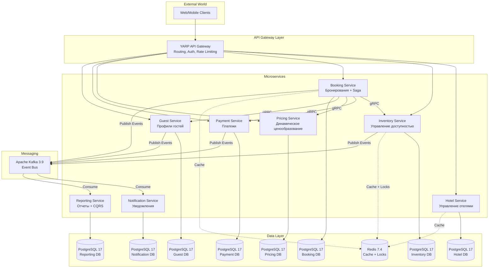

# 🏨 Hotel Booking & Revenue Management Platform

## 📖 О проекте

**Hotel Booking Platform** — микросервисная платформа для управления бронированием номеров в отелях с функцией динамического ценообразования.

---

### Ключевые особенности

| Особенность | Описание |
| :--- | :--- |
| 🏗️ **Микросервисная архитектура** | 8 независимых сервисов с собственными БД |
| 📨 **Event-Driven** | Асинхронное взаимодействие через Apache Kafka 3.9 |
| 🔄 **Saga Pattern** | Распределенные транзакции с компенсирующими операциями |
| 📦 **Transactional Outbox** | Гарантированная доставка событий |
| 📊 **CQRS** | Разделение на команды и запросы в Reporting Service |
| 💰 **Dynamic Pricing** | Ценообразование на основе спроса и сезонности |
| 🔍 **Observability** | Логи (Seq), метрики (Prometheus 3.0), трассировка (Jaeger 1.60) |

### Технологический стек

| Компонент | Технология | Версия |
| :--- | :--- | :--- |
| **Framework** | ASP.NET Core | 10.0 |
| **API** | REST + gRPC | gRPC 2.65 |
| **ORM** | Dapper | 2.1.35 |
| **Database** | PostgreSQL | 17 |
| **Cache** | Redis | 7.4 |
| **Message Broker** | Apache Kafka | 3.9 (KRaft) |
| **Logging** | Serilog + Seq | Serilog 4.2 |
| **Metrics** | Prometheus + Grafana | 3.0 / 11.3 |
| **Tracing** | OpenTelemetry + Jaeger | 1.9 / 1.60 |
| **Testing** | xUnit + Moq + k6 | xUnit 2.9 |

---

## 🏗️ Архитектура

### Диаграмма контейнеров (C4)

