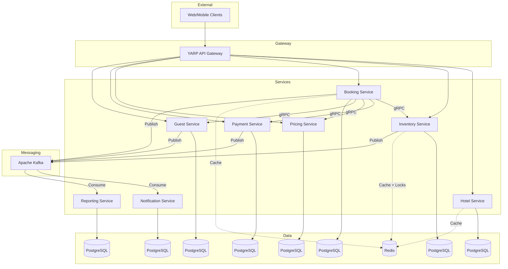

# 3. Системный дизайн

## 3.1. Архитектура

Микросервисная архитектура с Event-Driven взаимодействием.

Принципы:
- Database per Service
- Синхронная коммуникация: gRPC
- Асинхронная коммуникация: Kafka
- Кэширование: Redis

## 3.2. Диаграмма контейнеров



## 3.3. Коммуникационные паттерны

### Синхронная (gRPC)

| Сценарий | От | К |
| :--- | :--- | :--- |
| Проверка доступности | Booking | Inventory |
| Блокировка номера | Booking | Inventory |
| Авторизация платежа | Booking | Payment |
| Валидация гостя | Booking | Guest |
| Расчет цены | Booking | Pricing |

### Асинхронная (Kafka)

| Сценарий | От | К |
| :--- | :--- | :--- |
| Уведомления | Все сервисы | Notification |
| Обновление отчетов | Все сервисы | Reporting |
| События инвентаря | Inventory | Все сервисы |
| События бронирования | Booking | Все сервисы |
| События платежей | Payment | Все сервисы |

## 3.4. Паттерны

### Saga (Choreography)

Последовательность создания бронирования:

1. Booking создает запись со статусом DRAFT
2. Booking -> Inventory: CheckAvailability (gRPC)
3. Inventory -> Booking: Available
4. Booking -> Inventory: LockRoom (gRPC)
5. Inventory -> Kafka: inventory.locked
6. Booking -> Payment: AuthorizePayment (gRPC)
7. Payment -> Kafka: payment.authorized
8. Booking обновляет статус на CONFIRMED
9. Booking -> Kafka: booking.confirmed
10. Notification <- Kafka: booking.confirmed

Компенсация при ошибке на шаге 7:
1. Booking -> Inventory: ReleaseRoom (gRPC)
2. Inventory -> Kafka: inventory.released
3. Booking обновляет статус на CANCELLED
4. Booking -> Kafka: booking.cancelled

### Transactional Outbox

1. В одной транзакции БД:
   - Сохранение бизнес-данных
   - Сохранение события в outbox_messages (status = PENDING)
2. Фоновый процесс:
   - Чтение PENDING сообщений
   - Отправка в Kafka
   - При подтверждении: статус SENT
   - При ошибке: статус PENDING

### CQRS (Reporting Service)

- Команды: Kafka Consumer обновляет материализованные представления
- Запросы: REST API читает из оптимизированных таблиц

### Circuit Breaker

Применяется для всех gRPC клиентов:
- Максимум ошибок: 3
- Таймаут: 30 секунд
- Время ожидания перед Half-Open: 60 секунд

### Idempotency

Применяется в Booking и Payment сервисах:
- Запрос содержит Idempotency-Key (UUID)
- Ключ хранится в Redis (TTL: 24 часа)
- При повторном запросе возвращается кэшированный ответ

### Distributed Locking (Redis)

Блокировка номера при бронировании:
1. Ключ: lock:hotel:{id}:room:{id}:date:{date}
2. TTL: 15 минут
3. При существовании ключа: отказ
4. После подтверждения: удаление ключа

## 3.5. Kafka Topics

| Topic | Producer | Consumers |
| :--- | :--- | :--- |
| booking.created | Booking | Inventory, Pricing, Reporting |
| booking.confirmed | Booking | Notification, Guest, Reporting |
| booking.cancelled | Booking | Inventory, Payment, Notification, Reporting |
| booking.modified | Booking | Inventory, Pricing, Reporting |
| inventory.locked | Inventory | Booking, Reporting |
| inventory.released | Inventory | Booking, Reporting |
| payment.authorized | Payment | Booking, Reporting |
| payment.captured | Payment | Booking, Reporting |
| payment.refunded | Payment | Booking, Reporting |
| pricing.updated | Pricing | Reporting |
| guest.registered | Guest | Reporting, Notification |

Партиционирование:
- Ключ: hotel_id
- Количество партиций: 6
- Репликация: 2

## 3.6. Масштабирование

| Сервис | Реплик (Staging) | Реплик (Production) |
| :--- | :--- | :--- |
| Hotel Service | 2 | 3 |
| Inventory Service | 2 | 3 |
| Booking Service | 2 | 3 |
| Pricing Service | 1 | 2 |
| Payment Service | 2 | 3 |
| Guest Service | 2 | 2 |
| Notification Service | 1 | 2 |
| Reporting Service | 1 | 2 |
| PostgreSQL | 1 Primary + 1 Replica | 1 Primary + 2 Replicas |
| Redis | 3 узла (Sentinel) | 5 узлов |
| Kafka | 3 брокера | 5 брокеров |

Auto-scaling (KEDA):
- CPU > 70%: добавление реплик
- Memory > 80%: добавление реплик
- Kafka Consumer Lag > 1000: добавление консьюмеров
- RPS > 80% лимита: добавление реплик

## 3.7. Хранение данных

### PostgreSQL

Индексы:
- bookings(hotel_id, check_in_date, status)
- bookings(guest_id, status)
- inventory(hotel_id, room_id)
- room_locks(booking_id, expires_at)
- guests(email) UNIQUE

### Redis

| Данные | TTL | Сервис |
| :--- | :--- | :--- |
| Каталог отелей | 1 час | Hotel |
| Доступность номеров | 5 минут | Inventory |
| Профили гостей | 30 минут | Guest |
| Ценообразование | 5 минут | Pricing |
| Idempotency Keys | 24 часа | Booking/Payment |
| Distributed Locks | 15 минут | Inventory |

Стратегии:
- Cache-Aside: обновление -> удаление из кэша
- Write-Through: обновление -> обновление БД и кэша
- TTL: автоматическое истечение

## 3.8. Наблюдаемость

### Логирование (Serilog + Seq)

Структура:
```json
{
  "timestamp": "2026-07-26T10:30:00Z",
  "level": "Information",
  "service": "Booking.API",
  "operation": "CreateBooking",
  "booking_id": "123e4567",
  "correlation_id": "abc-123-def",
  "duration_ms": 245
}
```

### Метрики (Prometheus + Grafana)

Бизнес-метрики:
- bookings_total
- revenue_total
- occupancy_rate

Технические метрики:
- Request Rate, Latency (p50, p95, p99), Error Rate
- Kafka Consumer Lag
- PostgreSQL Connections
- Redis Hit/Miss Ratio
- CPU/Memory Usage

### Трассировка (OpenTelemetry + Jaeger)

- trace_id передается через gRPC метаданные и Kafka Headers
- Все сервисы отправляют spans в Jaeger

## 3.9. Безопасность

### Аутентификация (JWT)

- Токен: JWT
- Срок жизни: 1 час
- Передача: Authorization: Bearer
- Валидация: API Gateway

### Авторизация (RBAC)

| Роль | Доступ |
| :--- | :--- |
| ADMIN | Полный доступ |
| HOTEL_MANAGER | Управление своим отелем |
| GUEST | Только свои бронирования |
| ANALYST | Только чтение отчетов |

### Безопасность данных

- TLS для всех коммуникаций
- Шифрование паспортных данных в БД
- Audit Log всех изменений
